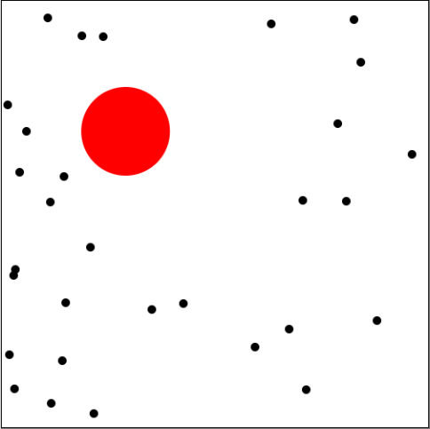

# Agar.io clone
### A simple clone of the popular game Agar.io
#### The project is unfinished, and was used to learn Canvas, it is possible to move the bloob with the mouse, eating small black bloob makes you bigger, but remember, if you are too big, you will be slower and get smaller every second
## to run use npm start and open at localhost:4000
